# 💰 Equinex - Smart Expense Sharing Platform

<div align="center">


**Split expenses effortlessly. Track spending smartly. Settle up seamlessly.**

[](https://equinex-two.vercel.app)
[](https://github.com/yourusername/equinex)
[](https://nextjs.org/)
[](https://www.convex.dev/)

*A college project demonstrating modern full-stack development with real-time features*

</div>

---

## 📖 About The Project

Equinex is a full-stack expense-sharing application built for the Indian market. It simplifies splitting bills with friends, roommates, or groups while providing real-time updates and smart settlement suggestions.

### 🎯 Problem Statement
Managing shared expenses often leads to:
- Confusion about who paid for what
- Difficulty tracking multiple debts
- Complex calculations for group bills
- Forgotten payments and awkward reminders

### ✨ Solution
Equinex provides a centralized platform to:
- Track all shared expenses in one place
- Automatically calculate who owes whom
- Send automated payment reminders
- Provide spending insights and analytics

---

## 🚀 Key Features

### 💳 Expense Management
- **Add Expenses**: Create expenses with description, amount, and category
- **Multiple Split Types**: 
  - **Equal Split**: Divide amount equally among all participants
  - **Percentage Split**: Assign custom percentages to each person
  - **Exact Amount Split**: Specify exact amounts for each participant
- **Smart Categorization**: 20+ expense categories (Food, Transport, Entertainment, etc.)
- **Auto-suggestions**: AI suggests categories based on expense description
- **Group & Individual**: Track both 1-to-1 and group expenses seamlessly
- **Real-time Updates**: See changes instantly across all devices

### 👥 Advanced Group Features
- **Create Groups**: Set up groups for roommates, trips, events, or projects
- **Smart Member Management**:
  - **Admin Controls**: Add or remove members from groups
  - **Bulk Member Addition**: Add multiple members at once
  - **Email Notifications**: New members receive automatic email invitations
  - **Transfer Admin Rights**: Admins can transfer ownership to other members
  - **Leave Group**: Members can leave groups anytime
  - **Admin Exit**: Admins must transfer admin rights before leaving
- **Activity Logs**: Complete audit trail of all group activities
  - Member additions/removals
  - Admin role transfers
  - Group creation events
- **Role-based Access**: Different permissions for admins and members

### 💰 Smart Settlement System
- **Settle Up**: Record payments between individuals or within groups
- **Optimized Suggestions**: Algorithm minimizes number of transactions
- **Balance Validation**: System prevents overpayments and incorrect amounts
- **Direction Validation**: Ensures payments flow in correct direction
- **Complete History**: Audit trail of all settlements with notes
- **Multi-currency**: Full support for Indian Rupees (₹)

### 📊 Analytics & Insights
- **Dashboard Overview**: Visual summary of your financial status
- **Balance Tracking**: 
  - Total Balance (What you're owed - What you owe)
  - Detailed breakdown of who owes you
  - Detailed breakdown of who you owe
- **Monthly Trends**: Track spending patterns over time with charts
- **Category Breakdown**: See where your money goes
- **Spending Charts**: Visual representation of monthly/yearly expenses

### 🔔 Automated Email Notifications

#### Daily Payment Reminders (10:00 AM IST)
- **Who Gets It**: Users with outstanding debts
- **What It Contains**:
  - List of all people you owe money to
  - Amount owed to each person
  - How long the debt has been pending
  - Direct link to settle up
- **Purpose**: Friendly reminder to clear pending payments

#### Monthly Spending Insights (1st of Month, 10:00 AM IST)
- **Who Gets It**: Users with expenses in the past month
- **What It Contains**:
  - **Total Spending**: Complete monthly expenditure
  - **Top Categories**: Your highest spending categories
  - **AI-Powered Insights**: 4 personalized tips including:
    - Overview of your spending patterns
    - Key observations about spending behavior
    - Specific money-saving suggestions
    - Encouraging financial habit reminders
  - **Savings Tips**: Category-specific advice to reduce expenses
- **Purpose**: Help users understand and optimize their spending habits

#### Group Invitation Emails
- **When Sent**: Immediately when a member is added to a group
- **What It Contains**:
  - Group name and inviter details
  - What you can do in the group
  - Direct link to view the group
- **Purpose**: Notify users about group membership

---

## 🛠 Tech Stack

### Frontend
```
Next.js 16 (App Router)  |  React 19  |  Tailwind CSS 4
Radix UI  |  Lucide Icons  |  React Hook Form + Zod
```

### Backend & Database
```
Convex (Backend-as-a-Service)  |  Convex Database (Real-time)
Clerk (Authentication)  |  Inngest (Background Jobs)
```

### Email & AI (Optional)
```
Nodemailer (Gmail SMTP)  |  Google Generative AI (Gemini)
```

---

## 🏗 System Architecture

```
┌─────────────────────────────────────────────────────────────┐
│                        Client Layer                          │
│  (Next.js 16 + React 19 + Tailwind CSS + Radix UI)         │
└────────────────────┬────────────────────────────────────────┘
                     │
                     ▼
┌─────────────────────────────────────────────────────────────┐
│                    Authentication Layer                      │
│                      (Clerk Auth)                           │
└────────────────────┬────────────────────────────────────────┘
                     │
                     ▼
┌─────────────────────────────────────────────────────────────┐
│                     Backend Layer (Convex)                   │
│  ┌──────────────┬──────────────┬──────────────────────┐    │
│  │   Queries    │  Mutations   │      Actions         │    │
│  │  (Real-time) │ (Write Ops)  │  (Side Effects)      │    │
│  └──────────────┴──────────────┴──────────────────────┘    │
└────────────────────┬────────────────────────────────────────┘
                     │
                     ▼
┌─────────────────────────────────────────────────────────────┐
│                   Database Layer (Convex DB)                 │
│  ┌──────┬───────────┬────────────┬────────┬─────────────┐  │
│  │Users │ Expenses  │Settlements │ Groups │ActivityLog  │  │
│  └──────┴───────────┴────────────┴────────┴─────────────┘  │
└────────────────────┬────────────────────────────────────────┘
                     │
                     ▼
┌─────────────────────────────────────────────────────────────┐
│               Background Jobs Layer (Inngest)                │
│  ┌──────────────────────┬──────────────────────────────┐   │
│  │  Payment Reminders   │   Monthly Spending Insights  │   │
│  │  (Daily @ 10 AM IST) │   (1st @ 10 AM IST)         │   │
│  └──────────────────────┴──────────────────────────────┘   │
└─────────────────────────────────────────────────────────────┘
```

### Key Architectural Decisions

1. **Real-time Data Sync**: Convex provides automatic real-time updates across all connected clients
2. **Optimized Queries**: Database indexes on frequently queried fields (`by_payer`, `by_receiver`, `by_group`)
3. **Unified Balance Calculation**: 4-step consistent calculation logic across all queries:
   - Step 1: Get all expenses where user is involved
   - Step 2: Calculate net balance per user from expenses
   - Step 3: Apply all settlements to adjust net balances
   - Step 4: Build UI lists and calculate global totals
4. **Orphaned Data Prevention**: Automatic cleanup of settlements when related expenses are deleted
5. **Lazy Loading**: Conditional rendering on heavy pages to improve initial load time

---

## 📱 User Flow

### 1. Authentication Flow


### 2. Adding an Expense Flow


### 3. Settlement Flow

```mermaid
graph TD
    A[Dashboard/Person Page] --> B[View Balance: 'You owe ₹X']
    B --> C[Click 'Settle Up']
    C --> D{1-to-1 or Group?}
    D -->|1-to-1| E[Select Person]
    D -->|Group| F[Select Group & Person]
    E --> G[Enter Amount ≤ Balance]
    F --> G
    G --> H[Add Optional Note]
    H --> I[Record Settlement]
    I --> J[Balance Updates in Real-time]
    J --> K{Balance = 0?}
    K -->|Yes| L[Show 'All Settled Up' ✅]
    K -->|No| M[Show Remaining Balance]
```



### 4. Group Management Flow


### 5. Complete User Journey

```
┌──────────────────────────────────────────────────────────────┐
│ 1. SIGN UP / SIGN IN (Clerk Authentication)                  │
└────────────────────┬─────────────────────────────────────────┘
                     ▼
┌──────────────────────────────────────────────────────────────┐
│ 2. WELCOME MODAL (First-time users)                          │
│    - Overview of features                                     │
│    - Quick start guide                                        │
└────────────────────┬─────────────────────────────────────────┘
                     ▼
┌──────────────────────────────────────────────────────────────┐
│ 3. DASHBOARD                                                  │
│    - Total Balance: ₹X                                        │
│    - You are owed: ₹Y (from N people)                        │
│    - You owe: ₹Z (to M people)                               │
│    - Recent Expenses                                          │
│    - Groups List                                              │
│    - Spending Charts (Monthly & Total)                        │
└────┬──────┬──────┬──────┬──────┬──────────────────────────┘
     │      │      │      │      │
     ▼      ▼      ▼      ▼      ▼
   Add    View   Create  View   View
 Expense Person  Group  Groups  Analytics
     │      │      │      │      │
     ▼      ▼      ▼      ▼      ▼
┌─────────────────────────────────────────────────────────────┐
│ 4. MANAGE & TRACK                                            │
│    - Add/Edit/Delete Expenses                                │
│    - Settle Up (1-to-1 or Group)                            │
│    - View Expense History                                    │
│    - Filter by Category/Date/Person                          │
│    - Add/Remove Group Members                                │
│    - Transfer Admin Rights                                   │
│    - View Activity Logs                                      │
└────────────────────┬────────────────────────────────────────┘
                     ▼
┌─────────────────────────────────────────────────────────────┐
│ 5. AUTOMATED NOTIFICATIONS                                   │
│    - Daily Payment Reminders (10 AM IST)                    │
│    - Monthly Spending Insights (1st of month, 10 AM IST)   │
│    - Group Invitation Emails                                 │
└─────────────────────────────────────────────────────────────┘
```

---

## 📸 Screenshots

### 1. Landing Page

*Modern, responsive landing page with feature highlights*

### 2. Dashboard

*Overview of balances, recent expenses, and spending charts*

### 3. Add Expense

*Intuitive expense creation with multiple split types*

### 4. Group Management

*Create groups, add members, and view activity logs*

### 5. Settlement Page

*Smart settlement suggestions with balance validation*

### 6. Automated Email Notifications

#### Daily Payment Reminder Email (10:00 AM IST)

*Automated email showing outstanding debts with settle-up links*

#### Monthly Spending Insights Email (1st of Month, 10:00 AM IST)

*AI-powered spending analysis with personalized savings tips*

#### Group Invitation Email

*Notification when added to a group with direct access link*

### 7. Backend Dashboards

#### Convex Dashboard

*Real-time database and backend functions management*

#### Inngest Dashboard

*Scheduled background jobs (payment reminders & insights)*

---

## 🚀 Getting Started

### Prerequisites
- Node.js 18+ and npm
- Convex Account ([convex.dev](https://www.convex.dev/))
- Clerk Account ([clerk.com](https://clerk.com/))
- Gmail Account (for email notifications)

### Installation

1. **Clone the repository**
   ```bash
   git clone https://github.com/yourusername/equinex.git
   cd equinex
   ```

2. **Install dependencies**
   ```bash
   npm install
   ```

3. **Set up Convex**
   ```bash
   npx convex dev
   ```
   This creates `.env.local` with `CONVEX_DEPLOYMENT` and `NEXT_PUBLIC_CONVEX_URL`

4. **Configure Environment Variables**
   
   Create `.env.local` in the root directory:
   ```env
   # Convex
   CONVEX_DEPLOYMENT=your-deployment-name
   NEXT_PUBLIC_CONVEX_URL=https://your-deployment.convex.cloud
   
   # Clerk
   NEXT_PUBLIC_CLERK_PUBLISHABLE_KEY=pk_test_...
   CLERK_SECRET_KEY=sk_test_...
   NEXT_PUBLIC_CLERK_SIGN_IN_URL=/sign-in
   NEXT_PUBLIC_CLERK_SIGN_UP_URL=/sign-up
   
   # Inngest (Optional)
   INNGEST_EVENT_KEY=your-event-key
   INNGEST_SIGNING_KEY=your-signing-key
   ```

5. **Set up Convex Environment Variables**
   
   In **Convex Dashboard → Production → Environment Variables**, add:
   ```env
   GMAIL_USER=your-email@gmail.com
   GMAIL_APP_PASSWORD=your-app-password
   CLERK_JWT_ISSUER_DOMAIN=your-clerk-domain.clerk.accounts.dev
   NEXT_PUBLIC_APP_URL=http://localhost:3000
   ```

6. **Run the development server**
   ```bash
   # Terminal 1: Convex
   npx convex dev
   
   # Terminal 2: Next.js
   npm run dev
   ```

7. **Open your browser**
   - Visit [http://localhost:3000](http://localhost:3000)
   - Sign up and start using Equinex!

---

## 🌐 Deployment

### Deploy to Vercel

1. **Push to GitHub**
   ```bash
   git init
   git add .
   git commit -m "Initial commit"
   git remote add origin https://github.com/yourusername/equinex.git
   git push -u origin main
   ```

2. **Deploy to Vercel**
   - Go to [vercel.com](https://vercel.com/)
   - Import your GitHub repository
   - **Build Command**: `npx convex deploy && next build`
   - Add all environment variables from `.env.local`
   - Click **Deploy**

3. **Configure Production**
   - Update `NEXT_PUBLIC_APP_URL` in Convex with your Vercel URL
   - Add your Vercel domain to Clerk's **Allowed Origins**
   - Set up Inngest (optional): Use Vercel Integration or manual sync

**Live Demo**: [https://equinex-two.vercel.app](https://equinex-two.vercel.app)

---

## 📊 Database Schema

### Core Tables

**Users**
- Stores user information (name, email, authentication)
- Indexed by token and email for fast lookups

**Expenses**
- Tracks all expenses (amount, description, category)
- Supports both individual and group expenses
- Contains splits array for participant shares

**Settlements**
- Records payments between users
- Links to related expenses
- Supports both 1-to-1 and group settlements

**Groups**
- Manages group information and members
- Role-based access (admin/member)
- Tracks member addition history

**Activity Logs**
- Tracks group activities (member changes, role transfers)
- Provides audit trail for transparency

---

## 🗄 Database Schema

### Visual Schema Overview


*Entity Relationship Diagram showing all tables and their relationships*

### Core Tables

#### **Users Table**
Stores user authentication and profile information.

```javascript
{
  _id: Id<"users">,
  name: string,
  email: string,
  tokenIdentifier: string,  // Clerk user ID
  imageUrl?: string,
  hasSeenWelcome?: boolean
}

// Indexes:
// - by_token (tokenIdentifier)
// - by_email (email)
// - search_name (name) - for user search
// - search_email (email) - for user search
```

#### **Expenses Table**
Tracks all expenses (individual and group).

```javascript
{
  _id: Id<"expenses">,
  description: string,
  amount: number,              // in rupees
  category?: string,           // foodDrink, transport, etc.
  date: number,                // timestamp
  paidByUserId: Id<"users">,
  splitType: "equal" | "percentage" | "exact",
  splits: [{
    userId: Id<"users">,
    amount: number,
    paid: boolean              // true if user was the payer
  }],
  groupId?: Id<"groups">,      // null for 1-to-1 expenses
  createdBy: Id<"users">
}

// Indexes:
// - by_group (groupId)
// - by_payer (paidByUserId) - CRITICAL for dashboard performance
// - by_date (date)
```

#### **Settlements Table**
Records payments between users.

```javascript
{
  _id: Id<"settlements">,
  amount: number,
  note?: string,
  date: number,                // timestamp
  paidByUserId: Id<"users">,
  receivedByUserId: Id<"users">,
  groupId?: Id<"groups">,      // null for 1-to-1 settlements
  relatedExpenseIds?: Id<"expenses">[],
  createdBy: Id<"users">
}

// Indexes:
// - by_group (groupId)
// - by_payer (paidByUserId) - CRITICAL for dashboard performance
// - by_receiver (receivedByUserId) - CRITICAL for dashboard performance
// - by_date (date)
```

#### **Groups Table**
Manages group information and members.

```javascript
{
  _id: Id<"groups">,
  name: string,
  description?: string,
  createdBy: Id<"users">,
  members: [{
    userId: Id<"users">,
    role: "admin" | "member",
    joinedAt: number,
    addedBy?: Id<"users">      // tracks who added this member
  }]
}
```

#### **Activity Log Table**
Tracks all group activities for audit trail.

```javascript
{
  _id: Id<"activityLog">,
  groupId: Id<"groups">,
  type: "member_added" | "member_removed" | "admin_transferred" | 
        "group_created" | "members_added_bulk",
  performedBy: Id<"users">,
  targetUserId?: Id<"users">,      // for single actions
  targetUserIds?: Id<"users">[],   // for bulk actions
  timestamp: number,
  metadata?: {
    memberCount?: number,
    addedCount?: number
  }
}

// Indexes:
// - by_group (groupId)
// - by_timestamp (timestamp)
```

### Relationships

```
Users ──┬─── Expenses (paidByUserId, splits.userId)
        ├─── Settlements (paidByUserId, receivedByUserId)
        ├─── Groups (createdBy, members.userId)
        └─── ActivityLog (performedBy, targetUserId)

Groups ─┬─── Expenses (groupId)
        ├─── Settlements (groupId)
        └─── ActivityLog (groupId)

Expenses ─── Settlements (relatedExpenseIds)
```

### Index Strategy

**Why Indexes Matter:**
- **O(log n) vs O(n)**: Indexes reduce query time from linear to logarithmic
- **Dashboard Performance**: Without `by_payer` and `by_receiver` indexes, dashboard would scan all expenses/settlements
- **Search Optimization**: Full-text search indexes enable real-time user search

**Critical Indexes:**
1. `by_payer` on Expenses - Dashboard balance calculation
2. `by_receiver` on Settlements - Dashboard balance calculation
3. `by_group` on Expenses - Group page queries
4. `search_name` and `search_email` on Users - User search functionality

---

## 🔑 Key Technical Decisions

### 1. Real-time Data with Convex
- **Why?** Instant updates across all devices without manual refresh
- **How?** Convex provides reactive queries that update automatically

### 2. Optimized Balance Calculations
Implemented 4-step consistent calculation logic:
1. Get all expenses where user is involved
2. Calculate net balance per user from expenses
3. Apply all settlements to adjust net balances
4. Build UI lists and calculate global totals

### 3. Smart Indexing
- Indexes on frequently queried fields (`by_payer`, `by_receiver`, `by_group`)
- Reduces query time from O(n) to O(log n)
- Critical for dashboard performance

### 4. Background Jobs with Inngest
- **Payment Reminders**: Daily at 10 AM IST
- **Spending Insights**: Monthly on 1st at 10 AM IST
- Runs reliably without blocking main application

---

## 📧 Email Notifications

### Gmail SMTP Setup

1. **Enable 2-Step Verification**
   - Go to [Google Account Security](https://myaccount.google.com/security)
   - Enable 2-Step Verification

2. **Generate App Password**
   - Go to [App Passwords](https://myaccount.google.com/apppasswords)
   - Create password for "Mail"
   - Use this as `GMAIL_APP_PASSWORD`

3. **Configure in Convex**
   - Add `GMAIL_USER` and `GMAIL_APP_PASSWORD` to Convex environment variables

---

## 🎓 Learning Outcomes

This project demonstrates:
- ✅ Full-stack development with modern React (Next.js 16)
- ✅ Real-time backend architecture (Convex)
- ✅ Authentication implementation (Clerk)
- ✅ Background job scheduling (Inngest)
- ✅ Email automation (Nodemailer)
- ✅ Database design and indexing
- ✅ Responsive UI design (Tailwind CSS)
- ✅ Form validation (React Hook Form + Zod)
- ✅ Error handling and user feedback
- ✅ Deployment and production setup

---

## 🤝 Contributing

This is a college project, but contributions are welcome!

1. Fork the repository
2. Create a feature branch (`git checkout -b feature/amazing-feature`)
3. Commit your changes (`git commit -m 'Add amazing feature'`)
4. Push to the branch (`git push origin feature/amazing-feature`)
5. Open a Pull Request

---

## 📄 License

This project is licensed under the **MIT License** - see the [LICENSE](LICENSE) file for details.

---

## 👨‍💻 Author

**[Your Name]**
- College: [Your College Name]
- Course: [Your Course/Branch]
- Year: [Your Year]
- Email: [your-email@example.com]
- GitHub: [@yourusername](https://github.com/yourusername)

---

## 🙏 Acknowledgments

- **Next.js** - The React Framework
- **Convex** - Real-time backend platform
- **Clerk** - Authentication service
- **Inngest** - Background job orchestration
- **Radix UI** - Accessible component library
- **Tailwind CSS** - Utility-first CSS framework

---

<div align="center">

**Made with ❤️ for Academic Excellence**

[](https://vercel.com/new/clone?repository-url=https://github.com/yourusername/equinex)

</div>
