# 💰 Equinex - Smart Expense Sharing Platform

**Live Demo:** [https://equinex-two.vercel.app](https://equinex-two.vercel.app)

---

## 📖 About The Project

Equinex is a full-stack expense-sharing application built for the Indian market. It simplifies splitting bills with friends, roommates, or groups while providing real-time updates and smart settlement suggestions.

<br/>


## 🎯 Problem Statement

Managing shared expenses manually often leads to:

- Confusion about who paid for what
- Difficulty tracking debts and group expenses  
- Forgotten payments and awkward reminders

<br/>

## 💡 Solution

Equinex simplifies expense tracking by providing a centralized platform to:

- Track and split expenses effortlessly
- Automatically calculate balances
- Send timely payment reminders
- Offer deep spending insights and analytics

<br/>

⭐ Highlights

🎯 Indian Market Focus - Built specifically for Indian users with ₹ currency support
⚡ Real-Time Sync - Instant updates across all devices without manual refresh
🧮 Smart Settlement Algorithm - Optimizes transactions to minimize payment steps
📧 Automated Email System - Daily payment reminders (10 AM IST) & monthly AI-powered spending insights
🤖 AI-Powered Suggestions - Auto-categorizes expenses and provides personalized savings tips
👥 Advanced Group Management - Role-based access, activity logs, and bulk member operations
📊 Comprehensive Analytics - Monthly trends, category breakdowns, and visual spending charts
🔐 Enterprise-Grade Security - Clerk authentication with secure data handling
🎨 Modern UI/UX - Built with Next.js 16, React 19, Tailwind CSS 4, and shadcn/ui
📱 Fully Responsive - Seamless experience across desktop, tablet, and mobile devices

## 🚀 Key Features


<br/>

### Expense Management

- **Add Expenses:** Add expenses with description, amount & category
- **Split Options:** Equal, Percentage, or Exact Amount splits
- **Smart Categorization:** 20+ categories (Food, Transport, etc.) with AI-based auto-suggestions
- **Group & Individual Tracking:** Manage both personal and shared expenses
- **Real-Time Sync:** Instant updates across all devices

### Group Management

- **Create Groups:** For trips, roommates, events, or projects
- **Smart Member Management:**
  - Admin controls (add/remove members, transfer ownership)
  - Bulk member addition
  - Automatic email invitations
- **Activity Logs:** Track member updates, role transfers, and group changes
- **Role-Based Access:** Different permissions for admins and members

### Smart Settlements

- **Settle Up:** Record payments between individuals or within groups
- **Optimized Suggestions:** Algorithm minimizes total transactions
- **Validation Checks:** Prevents overpayments & incorrect directions
- **Complete History:** Full audit trail of settlements with notes
- **Multi-Currency:** Supports Indian Rupees (₹)

### Analytics & Insights

- **Dashboard Overview:** Get a summary of balances & spending
- **Balance Tracking:** View who owes you and who you owe
- **Trends & Breakdown:** Monthly patterns and category-wise analysis
- **Spending Insights:** Identify top spending categories and habits

### Automated Email Notifications

- **Daily Payment Reminders (10:00 AM IST):**
  - Receive reminders for pending debts with direct settle-up links
  
- **Monthly Insights (1st of each month):**
  - Get total spending reports, top categories, and AI-powered saving tips
  
- **Group Invitations:**
  - Sent automatically when new members are added to a group


<br/>

## 🎯 Purpose

To simplify shared expense management, promote transparency, and help users make smarter financial decisions.

---

## 🛠️ Tech Stack

### Frontend
- **Next.js 16** (App Router)
- **React 19**
- **Tailwind CSS 4**
- **shadcn/ui** (Component Library)
- **Radix UI** (Primitives)
- **Lucide Icons**
- **React Hook Form + Zod** (Validation)

### Backend & Database
- **Convex** (Backend-as-a-Service)
- **Convex Database** (Real-time)
- **Clerk** (Authentication)
- **Inngest** (Background Jobs)

### Email & AI
- **Nodemailer** (Gmail SMTP)
- **Google Generative AI** (Gemini)

---

## 🏗️ System Architecture

```
┌─────────────────────────────────────────────────────────────┐
│                        Client Layer                          │
│  (Next.js 16 + React 19 + Tailwind CSS + shadcn/ui)        │
└────────────────────┬────────────────────────────────────────┘
                     │
                     ▼
┌─────────────────────────────────────────────────────────────┐
│                    Authentication Layer                      │
│                      (Clerk Auth)                           │
└────────────────────┬────────────────────────────────────────┘
                     │
                     ▼
┌─────────────────────────────────────────────────────────────┐
│                     Backend Layer (Convex)                   │
│  ┌──────────────┬──────────────┬──────────────────────┐    │
│  │   Queries    │  Mutations   │      Actions         │    │
│  │  (Real-time) │ (Write Ops)  │  (Side Effects)      │    │
│  └──────────────┴──────────────┴──────────────────────┘    │
└────────────────────┬────────────────────────────────────────┘
                     │
                     ▼
┌─────────────────────────────────────────────────────────────┐
│                   Database Layer (Convex DB)                 │
│  ┌──────┬───────────┬────────────┬────────┬─────────────┐  │
│  │Users │ Expenses  │Settlements │ Groups │ActivityLog  │  │
│  └──────┴───────────┴────────────┴────────┴─────────────┘  │
└────────────────────┬────────────────────────────────────────┘
                     │
                     ▼
┌─────────────────────────────────────────────────────────────┐
│               Background Jobs Layer (Inngest)                │
│  ┌──────────────────────┬──────────────────────────────┐   │
│  │  Payment Reminders   │   Monthly Spending Insights  │   │
│  │  (Daily @ 10 AM IST) │   (1st @ 10 AM IST)         │   │
│  └──────────────────────┴──────────────────────────────┘   │
└─────────────────────────────────────────────────────────────┘
```

### Key Architectural Decisions

1. **Real-time Data Sync:** Convex provides automatic real-time updates across all connected clients
2. **Optimized Queries:** Database indexes on frequently queried fields (`by_payer`, `by_receiver`, `by_group`)
3. **Unified Balance Calculation:** 4-step consistent calculation logic across all queries
4. **Orphaned Data Prevention:** Automatic cleanup of settlements when related expenses are deleted
5. **Lazy Loading:** Conditional rendering on heavy pages to improve initial load time

<br/>

---

## 📱 User Flow

<details>
<summary><b>🔄 View detailed user flows</b></summary>

<br/>

### 1. Authentication Flow


### 2. Adding an Expense Flow


### 3. Settlement Flow

```mermaid
graph TD
    A[Dashboard/Person Page] --> B[View Balance: 'You owe ₹X']
    B --> C[Click 'Settle Up']
    C --> D{1-to-1 or Group?}
    D -->|1-to-1| E[Select Person]
    D -->|Group| F[Select Group & Person]
    E --> G[Enter Amount ≤ Balance]
    F --> G
    G --> H[Add Optional Note]
    H --> I[Record Settlement]
    I --> J[Balance Updates in Real-time]
    J --> K{Balance = 0?}
    K -->|Yes| L[Show 'All Settled Up' ✅]
    K -->|No| M[Show Remaining Balance]
```



### 4. Group Management Flow


</details>

<br/>

---

## 📸 Screenshots


<br/>

### Landing Page


### Dashboard


### Add Expense


### Group Management


### Settlement Page


### Automated Email Notifications

#### Daily Payment Reminder


#### Monthly Spending Insights


#### Group Invitation


### Backend Dashboards

#### Convex Dashboard


#### Inngest Dashboard


<br/>

---

## 🚀 Getting Started

### Prerequisites
- Node.js 18+ and npm
- Convex Account ([convex.dev](https://www.convex.dev/))
- Clerk Account ([clerk.com](https://clerk.com/))
- Gmail Account (for email notifications)

### Installation

1. **Clone the repository**
   ```bash
   git clone https://github.com/yourusername/equinex.git
   cd equinex
   ```

2. **Install dependencies**
   ```bash
   npm install
   ```

3. **Set up Convex**
   ```bash
   npx convex dev
   ```
   This creates `.env.local` with `CONVEX_DEPLOYMENT` and `NEXT_PUBLIC_CONVEX_URL`

4. **Configure Environment Variables**
   
   Create `.env.local` in the root directory:
   ```env
   # Convex
   CONVEX_DEPLOYMENT=your-deployment-name
   NEXT_PUBLIC_CONVEX_URL=https://your-deployment.convex.cloud
   
   # Clerk
   NEXT_PUBLIC_CLERK_PUBLISHABLE_KEY=pk_test_...
   CLERK_SECRET_KEY=sk_test_...
   NEXT_PUBLIC_CLERK_SIGN_IN_URL=/sign-in
   NEXT_PUBLIC_CLERK_SIGN_UP_URL=/sign-up
   
   # Inngest (Optional)
   INNGEST_EVENT_KEY=your-event-key
   INNGEST_SIGNING_KEY=your-signing-key
   ```

5. **Set up Convex Environment Variables**
   
   In **Convex Dashboard → Production → Environment Variables**, add:
   ```env
   GMAIL_USER=your-email@gmail.com
   GMAIL_APP_PASSWORD=your-app-password
   CLERK_JWT_ISSUER_DOMAIN=your-clerk-domain.clerk.accounts.dev
   NEXT_PUBLIC_APP_URL=http://localhost:3000
   ```

6. **Run the development server**
   ```bash
   # Terminal 1: Convex
   npx convex dev
   
   # Terminal 2: Next.js
   npm run dev
   ```

7. **Open your browser**
   - Visit [http://localhost:3000](http://localhost:3000)
   - Sign up and start using Equinex!

---

## 🌐 Deployment

### Deploy to Vercel

1. **Push to GitHub**
   ```bash
   git init
   git add .
   git commit -m "Initial commit"
   git remote add origin https://github.com/yourusername/equinex.git
   git push -u origin main
   ```

2. **Deploy to Vercel**
   - Go to [vercel.com](https://vercel.com/)
   - Import your GitHub repository
   - **Build Command:** `npx convex deploy && next build`
   - Add all environment variables from `.env.local`
   - Click **Deploy**

3. **Configure Production**
   - Update `NEXT_PUBLIC_APP_URL` in Convex with your Vercel URL
   - Add your Vercel domain to Clerk's **Allowed Origins**
   - Set up Inngest (optional): Use Vercel Integration or manual sync

---

## 🗄️ Database Schema

### Visual Schema Overview


### Core Tables

**Users**
- Stores user information (name, email, authentication)
- Indexed by token and email for fast lookups

**Expenses**
- Tracks all expenses (amount, description, category)
- Supports both individual and group expenses
- Contains splits array for participant shares

**Settlements**
- Records payments between users
- Links to related expenses
- Supports both 1-to-1 and group settlements

**Groups**
- Manages group information and members
- Role-based access (admin/member)
- Tracks member addition history

**Activity Logs**
- Tracks group activities (member changes, role transfers)
- Provides audit trail for transparency

### Relationships

```
Users ──┬─── Expenses (paidByUserId, splits.userId)
        ├─── Settlements (paidByUserId, receivedByUserId)
        ├─── Groups (createdBy, members.userId)
        └─── ActivityLog (performedBy, targetUserId)

Groups ─┬─── Expenses (groupId)
        ├─── Settlements (groupId)
        └─── ActivityLog (groupId)

Expenses ─── Settlements (relatedExpenseIds)
```

### Index Strategy

**Why Indexes Matter:**
- **O(log n) vs O(n):** Indexes reduce query time from linear to logarithmic
- **Dashboard Performance:** Without indexes, dashboard would scan all expenses/settlements
- **Search Optimization:** Full-text search indexes enable real-time user search

**Critical Indexes:**
1. `by_payer` on Expenses - Dashboard balance calculation
2. `by_receiver` on Settlements - Dashboard balance calculation
3. `by_group` on Expenses - Group page queries
4. `search_name` and `search_email` on Users - User search functionality

---

## 🔑 Key Technical Decisions

### 1. Real-time Data with Convex
- **Why?** Instant updates across all devices without manual refresh
- **How?** Convex provides reactive queries that update automatically

### 2. Optimized Balance Calculations
Implemented 4-step consistent calculation logic:
1. Get all expenses where user is involved
2. Calculate net balance per user from expenses
3. Apply all settlements to adjust net balances
4. Build UI lists and calculate global totals

### 3. Smart Indexing
- Indexes on frequently queried fields
- Reduces query time from O(n) to O(log n)
- Critical for dashboard performance

### 4. Background Jobs with Inngest
- **Payment Reminders:** Daily at 10 AM IST
- **Spending Insights:** Monthly on 1st at 10 AM IST
- Runs reliably without blocking main application

---

## 📧 Email Notifications

### Gmail SMTP Setup

1. **Enable 2-Step Verification**
   - Go to [Google Account Security](https://myaccount.google.com/security)
   - Enable 2-Step Verification

2. **Generate App Password**
   - Go to [App Passwords](https://myaccount.google.com/apppasswords)
   - Create password for "Mail"
   - Use this as `GMAIL_APP_PASSWORD`

3. **Configure in Convex**
   - Add `GMAIL_USER` and `GMAIL_APP_PASSWORD` to Convex environment variables

---

## 🎓 Learning Outcomes

This project demonstrates:
- ✅ Full-stack development with modern React (Next.js 16)
- ✅ Real-time backend architecture (Convex)
- ✅ Authentication implementation (Clerk)
- ✅ Background job scheduling (Inngest)
- ✅ Email automation (Nodemailer)
- ✅ Database design and indexing
- ✅ Responsive UI design (Tailwind CSS + shadcn/ui)
- ✅ Form validation (React Hook Form + Zod)
- ✅ Error handling and user feedback
- ✅ Deployment and production setup

---

## 🙏 Acknowledgments

- **Next.js** - The React Framework
- **Convex** - Real-time backend platform
- **Clerk** - Authentication service
- **Inngest** - Background job orchestration
- **shadcn/ui** - Beautiful component library
- **Radix UI** - Accessible component primitives
- **Tailwind CSS** - Utility-first CSS framework

---

<div align="center">
  
**Built with ❤️ for seamless expense sharing**

</div>
