# 💰 Equinex - Smart Expense Sharing Platform

<div align="center">


**Split expenses effortlessly. Track spending smartly. Settle up seamlessly.**

[](https://equinex-two.vercel.app)
[](https://nextjs.org/)
[](https://www.convex.dev/)
[](LICENSE)

</div>

---

## 📋 Table of Contents

- [Overview](#-overview)
- [Features](#-features)
- [Tech Stack](#-tech-stack)
- [Architecture](#-architecture)
- [User Flow](#-user-flow)
- [Getting Started](#-getting-started)
- [Environment Variables](#-environment-variables)
- [Deployment](#-deployment)
- [Database Schema](#-database-schema)
- [API Structure](#-api-structure)
- [Screenshots](#-screenshots)
- [Contributing](#-contributing)
- [License](#-license)

---

## 🌟 Overview

**Equinex** is a modern, full-stack expense-sharing application designed for the Indian market. Whether you're splitting bills with roommates, managing group trip expenses, or tracking personal IOUs, Equinex makes it effortless.

### 🎯 Key Highlights

- 💵 **Indian Rupee (₹) Support** - All amounts in INR
- ⚡ **Real-time Updates** - Powered by Convex for instant synchronization
- 🧠 **Smart Settlements** - Minimizes payment transactions
- 📊 **Expense Analytics** - Track spending patterns with beautiful charts
- 🔔 **Automated Reminders** - Daily payment reminders at 10 AM IST
- 📱 **Responsive Design** - Works seamlessly on mobile, tablet, and desktop
- 🔐 **Secure Authentication** - Powered by Clerk

---

## ✨ Features

### 💳 Expense Management
- **Individual Expenses**: Track one-on-one expenses between friends
- **Group Expenses**: Create groups for roommates, trips, or events
- **Multiple Split Types**:
  - Equal split
  - Percentage-based split
  - Exact amount split
- **Auto-categorization**: AI-powered category suggestions based on expense description
- **Category Tracking**: 10+ predefined categories (Food, Transport, Entertainment, etc.)

### 👥 Group Features
- **Create & Manage Groups**: Unlimited groups with customizable names and descriptions
- **Member Management**: Add/remove members, transfer admin rights
- **Activity Log**: Track all group activities (member additions, removals, role changes)
- **Bulk Operations**: Add multiple members at once
- **Group Balances**: Real-time balance calculations for all members

### 💰 Settlement System
- **Smart Settlement Suggestions**: Minimize number of transactions
- **1-to-1 Settlements**: Pay individuals directly
- **Group Settlements**: Settle balances within groups
- **Settlement History**: Complete audit trail of all payments
- **Balance Validation**: Prevents overpayments and incorrect settlements

### 📊 Analytics & Insights
- **Dashboard Overview**: 
  - Total Balance (You are owed - You owe)
  - Detailed breakdown of who owes you
  - Detailed breakdown of who you owe
- **Spending Insights**:
  - Monthly spending trends
  - Category-wise breakdown
  - Spending patterns over time
- **Monthly Reports**: Automated email insights on the 1st of every month at 10 AM IST

### 🔔 Smart Notifications
- **Payment Reminders**: Daily automated reminders at 10 AM IST for outstanding debts
- **Group Invitations**: Email notifications when added to a group
- **Activity Updates**: Real-time updates for group activities

### 🔍 Advanced Features
- **User Search**: Find and add any Equinex user by email
- **Contact Management**: Maintain a list of frequent contacts
- **Expense Filtering**: Filter by date, category, group, or person
- **Pagination**: Load-more functionality for activity logs
- **Dark Mode Support**: System-aware theme switching
- **Responsive UI**: Beautiful Material Design-inspired interface

---

## 🛠 Tech Stack

### Frontend
- **[Next.js 16](https://nextjs.org/)** - React framework with App Router
- **[React 19](https://react.dev/)** - Latest React features
- **[Tailwind CSS 4](https://tailwindcss.com/)** - Utility-first styling
- **[Radix UI](https://www.radix-ui.com/)** - Accessible component primitives
- **[Lucide Icons](https://lucide.dev/)** - Beautiful icon library
- **[Recharts](https://recharts.org/)** - Responsive charts
- **[React Hook Form](https://react-hook-form.com/)** + **[Zod](https://zod.dev/)** - Form validation

### Backend
- **[Convex](https://www.convex.dev/)** - Real-time backend as a service
  - Reactive Queries
  - Mutations
  - Actions (for email sending)
  - Cron Jobs (via Inngest integration)
- **[Inngest](https://www.inngest.com/)** - Background jobs and scheduled tasks
- **[Nodemailer](https://nodemailer.com/)** - Email service (Gmail SMTP)

### Authentication & Database
- **[Clerk](https://clerk.com/)** - User authentication and management
- **Convex Database** - Document-based database with real-time sync

### AI & Analytics
- **[Google Generative AI](https://ai.google.dev/)** - AI-powered features (optional)

### Development Tools
- **ESLint** - Code linting
- **Prettier** (via Tailwind) - Code formatting
- **Git** - Version control
- **Vercel** - Deployment platform

---

## 🏗 Architecture

```
┌─────────────────────────────────────────────────────────────┐
│                        Client Layer                          │
│  (Next.js 16 + React 19 + Tailwind CSS + Radix UI)         │
└────────────────────┬────────────────────────────────────────┘
                     │
                     ▼
┌─────────────────────────────────────────────────────────────┐
│                    Authentication Layer                      │
│                      (Clerk Auth)                           │
└────────────────────┬────────────────────────────────────────┘
                     │
                     ▼
┌─────────────────────────────────────────────────────────────┐
│                     Backend Layer (Convex)                   │
│  ┌──────────────┬──────────────┬──────────────────────┐    │
│  │   Queries    │  Mutations   │      Actions         │    │
│  │  (Real-time) │ (Write Ops)  │  (Side Effects)      │    │
│  └──────────────┴──────────────┴──────────────────────┘    │
└────────────────────┬────────────────────────────────────────┘
                     │
                     ▼
┌─────────────────────────────────────────────────────────────┐
│                   Database Layer (Convex DB)                 │
│  ┌──────┬───────────┬────────────┬────────┬─────────────┐  │
│  │Users │ Expenses  │Settlements │ Groups │ActivityLog  │  │
│  └──────┴───────────┴────────────┴────────┴─────────────┘  │
└────────────────────┬────────────────────────────────────────┘
                     │
                     ▼
┌─────────────────────────────────────────────────────────────┐
│               Background Jobs Layer (Inngest)                │
│  ┌──────────────────────┬──────────────────────────────┐   │
│  │  Payment Reminders   │   Monthly Spending Insights  │   │
│  │  (Daily @ 10 AM IST) │   (1st @ 10 AM IST)         │   │
│  └──────────────────────┴──────────────────────────────┘   │
└─────────────────────────────────────────────────────────────┘
```

### Key Architectural Decisions

1. **Real-time Data Sync**: Convex provides automatic real-time updates across all connected clients
2. **Optimized Queries**: Database indexes on frequently queried fields (`by_payer`, `by_receiver`, `by_group`)
3. **Unified Balance Calculation**: 4-step consistent calculation logic across all queries:
   - Step 1: Get all expenses where user is involved
   - Step 2: Calculate net balance per user from expenses
   - Step 3: Apply all settlements to adjust net balances
   - Step 4: Build UI lists and calculate global totals
4. **Orphaned Data Prevention**: Automatic cleanup of settlements when related expenses are deleted
5. **Lazy Loading**: Conditional rendering on heavy pages to improve initial load time

---

## 📱 User Flow

### 1. Authentication Flow


### 2. Adding an Expense Flow


### 3. Settlement Flow

```mermaid
graph TD
    A[Dashboard/Person Page] --> B[View Balance: 'You owe ₹X']
    B --> C[Click 'Settle Up']
    C --> D{1-to-1 or Group?}
    D -->|1-to-1| E[Select Person]
    D -->|Group| F[Select Group & Person]
    E --> G[Enter Amount ≤ Balance]
    F --> G
    G --> H[Add Optional Note]
    H --> I[Record Settlement]
    I --> J[Balance Updates in Real-time]
    J --> K{Balance = 0?}
    K -->|Yes| L[Show 'All Settled Up' ✅]
    K -->|No| M[Show Remaining Balance]
```



### 4. Group Management Flow


### 5. Complete User Journey

```
┌──────────────────────────────────────────────────────────────┐
│ 1. SIGN UP / SIGN IN (Clerk Authentication)                  │
└────────────────────┬─────────────────────────────────────────┘
                     ▼
┌──────────────────────────────────────────────────────────────┐
│ 2. WELCOME MODAL (First-time users)                          │
│    - Overview of features                                     │
│    - Quick start guide                                        │
└────────────────────┬─────────────────────────────────────────┘
                     ▼
┌──────────────────────────────────────────────────────────────┐
│ 3. DASHBOARD                                                  │
│    - Total Balance: ₹X                                        │
│    - You are owed: ₹Y (from N people)                        │
│    - You owe: ₹Z (to M people)                               │
│    - Recent Expenses                                          │
│    - Groups List                                              │
│    - Spending Charts (Monthly & Total)                        │
└────┬──────┬──────┬──────┬──────┬──────────────────────────┘
     │      │      │      │      │
     ▼      ▼      ▼      ▼      ▼
   Add    View   Create  View   View
 Expense Person  Group  Groups  Analytics
     │      │      │      │      │
     ▼      ▼      ▼      ▼      ▼
┌─────────────────────────────────────────────────────────────┐
│ 4. MANAGE & TRACK                                            │
│    - Add/Edit/Delete Expenses                                │
│    - Settle Up (1-to-1 or Group)                            │
│    - View Expense History                                    │
│    - Filter by Category/Date/Person                          │
│    - Add/Remove Group Members                                │
│    - Transfer Admin Rights                                   │
│    - View Activity Logs                                      │
└────────────────────┬────────────────────────────────────────┘
                     ▼
┌─────────────────────────────────────────────────────────────┐
│ 5. AUTOMATED NOTIFICATIONS                                   │
│    - Daily Payment Reminders (10 AM IST)                    │
│    - Monthly Spending Insights (1st of month, 10 AM IST)   │
│    - Group Invitation Emails                                 │
└─────────────────────────────────────────────────────────────┘
```

---

## 🚀 Getting Started

### Prerequisites

- **Node.js** 18+ and npm
- **Git**
- **Convex Account** ([convex.dev](https://www.convex.dev/))
- **Clerk Account** ([clerk.com](https://clerk.com/))
- **Gmail Account** (for email notifications)
- **Inngest Account** ([inngest.com](https://www.inngest.com/)) - Optional but recommended

### Installation

1. **Clone the repository**
   ```bash
   git clone https://github.com/yourusername/equinex.git
   cd equinex
   ```

2. **Install dependencies**
   ```bash
   npm install
   ```

3. **Set up Convex**
   ```bash
   npx convex dev
   ```
   - Follow the prompts to create a new project
   - This will create a `.env.local` file with `CONVEX_DEPLOYMENT` and `NEXT_PUBLIC_CONVEX_URL`

4. **Set up Clerk**
   - Create a new application at [clerk.com](https://clerk.com/)
   - Get your API keys from the dashboard
   - Add them to `.env.local`

5. **Configure environment variables** (See [Environment Variables](#-environment-variables) section)

6. **Run the development server**
   ```bash
   # Terminal 1: Run Convex
   npx convex dev

   # Terminal 2: Run Next.js
   npm run dev
   ```

7. **Open your browser**
   - Visit [http://localhost:3000](http://localhost:3000)
   - Sign up and start using Equinex!

---

## 🔐 Environment Variables

### Local Development (`.env.local`)

```env
# Convex
CONVEX_DEPLOYMENT=your-deployment-name
NEXT_PUBLIC_CONVEX_URL=https://your-deployment.convex.cloud

# Clerk Authentication
NEXT_PUBLIC_CLERK_PUBLISHABLE_KEY=pk_test_...
CLERK_SECRET_KEY=sk_test_...
NEXT_PUBLIC_CLERK_SIGN_IN_URL=/sign-in
NEXT_PUBLIC_CLERK_SIGN_UP_URL=/sign-up

# Inngest (Optional - for background jobs)
INNGEST_EVENT_KEY=your-event-key
INNGEST_SIGNING_KEY=your-signing-key
```

### Convex Production Environment Variables

Set these in **Convex Dashboard → Production → Environment Variables**:

```env
# Gmail SMTP (for email notifications)
GMAIL_USER=your-email@gmail.com
GMAIL_APP_PASSWORD=your-app-password

# Clerk JWT (for authentication)
CLERK_JWT_ISSUER_DOMAIN=your-clerk-domain.clerk.accounts.dev

# App URL
NEXT_PUBLIC_APP_URL=https://equinex-two.vercel.app
```

### Vercel Production Environment Variables

Set these in **Vercel Dashboard → Settings → Environment Variables**:

```env
# Convex
NEXT_PUBLIC_CONVEX_URL=https://your-deployment.convex.cloud

# Clerk
NEXT_PUBLIC_CLERK_PUBLISHABLE_KEY=pk_live_...
CLERK_SECRET_KEY=sk_live_...
NEXT_PUBLIC_CLERK_SIGN_IN_URL=/sign-in
NEXT_PUBLIC_CLERK_SIGN_UP_URL=/sign-up

# Inngest
INNGEST_EVENT_KEY=your-event-key
INNGEST_SIGNING_KEY=your-signing-key
```

### How to Get These Keys

#### 1. Convex
- Sign up at [convex.dev](https://www.convex.dev/)
- Run `npx convex dev` - it will generate your deployment URL
- For production: Deploy via Convex dashboard and get production URL

#### 2. Clerk
- Sign up at [clerk.com](https://clerk.com/)
- Create a new application
- Go to **API Keys** tab
- Copy `Publishable Key` and `Secret Key`
- For `CLERK_JWT_ISSUER_DOMAIN`: Go to **JWT Templates** → Copy issuer domain

#### 3. Gmail App Password
- Go to [Google Account Security](https://myaccount.google.com/security)
- Enable **2-Step Verification**
- Go to **App Passwords**
- Generate a new app password for "Mail"
- Use this as `GMAIL_APP_PASSWORD`

#### 4. Inngest
- Sign up at [inngest.com](https://www.inngest.com/)
- Go to **Settings → Keys**
- Copy `Event Key` and `Signing Key`
- **OR** use Vercel Integration for automatic setup

---

## 🌐 Deployment

### Deploy to Vercel

1. **Push to GitHub**
   ```bash
   git init
   git add .
   git commit -m "Initial commit"
   git branch -M main
   git remote add origin https://github.com/yourusername/equinex.git
   git push -u origin main
   ```

2. **Deploy to Vercel**
   - Go to [vercel.com](https://vercel.com/)
   - Click **"Import Project"**
   - Select your GitHub repository
   - **Build Command**: `npx convex deploy && next build`
   - Add all environment variables (see [Environment Variables](#-environment-variables))
   - Click **Deploy**

3. **Configure Convex for Production**
   - Go to Convex Dashboard → Production
   - Add production environment variables
   - Update `NEXT_PUBLIC_APP_URL` to your Vercel URL

4. **Configure Clerk for Production**
   - Go to Clerk Dashboard → API Keys
   - Add your Vercel domain to **Allowed Origins**
   - Update Vercel environment variables with production keys

5. **Configure Inngest** (Optional but recommended)
   - **Option A**: Use Vercel Integration
     - Go to Inngest Dashboard → Integrations → Vercel
     - Connect your Vercel project
     - Inngest will automatically sync keys and functions
   - **Option B**: Manual Setup
     - Go to Inngest Dashboard → Apps → Syncs
     - Add sync URL: `https://your-domain.vercel.app/api/inngest`
     - Manually add `INNGEST_EVENT_KEY` and `INNGEST_SIGNING_KEY` to Vercel

### Build Command Explained

```bash
npx convex deploy && next build
```

This command:
1. Deploys your Convex functions to production
2. Builds your Next.js application

### Verifying Deployment

- **Frontend**: Visit `https://your-domain.vercel.app`
- **Convex**: Check Convex Dashboard for deployed functions
- **Inngest**: Visit `https://your-domain.vercel.app/api/inngest` (should show `authentication_succeeded: true`)

---

## 🗄 Database Schema

### Users Table
```javascript
{
  name: string,
  email: string,
  tokenIdentifier: string, // Clerk user ID
  imageUrl?: string,
  hasSeenWelcome?: boolean
}
```

### Expenses Table
```javascript
{
  description: string,
  amount: number, // in rupees
  category?: string,
  date: number, // timestamp
  paidByUserId: Id<"users">,
  splitType: "equal" | "percentage" | "exact",
  splits: [{
    userId: Id<"users">,
    amount: number,
    paid: boolean
  }],
  groupId?: Id<"groups">, // null for 1-to-1
  createdBy: Id<"users">
}
```

### Settlements Table
```javascript
{
  amount: number,
  note?: string,
  date: number,
  paidByUserId: Id<"users">,
  receivedByUserId: Id<"users">,
  groupId?: Id<"groups">,
  relatedExpenseIds?: Id<"expenses">[],
  createdBy: Id<"users">
}
```

### Groups Table
```javascript
{
  name: string,
  description?: string,
  createdBy: Id<"users">,
  members: [{
    userId: Id<"users">,
    role: "admin" | "member",
    joinedAt: number,
    addedBy?: Id<"users">
  }]
}
```

### Activity Log Table
```javascript
{
  groupId: Id<"groups">,
  type: "member_added" | "member_removed" | "admin_transferred" | "group_created" | "members_added_bulk",
  performedBy: Id<"users">,
  targetUserId?: Id<"users">, // single action
  targetUserIds?: Id<"users">[], // bulk action
  timestamp: number,
  metadata?: {
    memberCount?: number,
    addedCount?: number
  }
}
```

---

## 📡 API Structure

### Queries (Read Operations)

```
convex/
├── dashboard.js
│   ├── getUserBalances      - Get total balances (you owe, you are owed)
│   ├── getTotalSpent         - Monthly & total spending
│   ├── getMonthlySpending    - Month-wise breakdown
│   ├── getUserGroups         - All groups user is member of
│   └── shouldShowWelcome     - Check if first-time user
│
├── expenses.js
│   ├── getExpensesBetweenUsers - All expenses between two users
│   ├── getRecentExpenses       - Latest expenses
│   └── getExpensesByCategory   - Category-wise breakdown
│
├── groups.js
│   ├── getGroup                - Group details
│   ├── getGroupExpenses        - All expenses in a group
│   ├── getGroupActivityLog     - Activity log with pagination
│   └── getGroupOrMembers       - Groups or members for dropdown
│
├── settlements.js
│   └── getSettlementData       - Settlement suggestions and history
│
└── users.js
    ├── getCurrentUserPublic    - Current user data
    ├── getUserById             - User by ID
    ├── searchUsers             - Search all users by email
    └── getContacts             - Frequent contacts
```

### Mutations (Write Operations)

```
convex/
├── expenses.js
│   ├── createExpense           - Add new expense
│   ├── updateExpense           - Edit expense
│   └── deleteExpense           - Delete expense + cleanup
│
├── groups.js
│   ├── createGroup             - Create new group
│   ├── addMembersToGroup       - Add members (single/bulk)
│   ├── removeMemberFromGroup   - Remove member
│   ├── transferAdminRole       - Transfer admin rights
│   ├── leaveGroup              - Leave group
│   └── deleteGroup             - Delete group
│
├── settlements.js
│   └── createSettlement        - Record payment
│
└── users.js
    ├── storeUser               - Create/update user
    └── markWelcomeSeen         - Hide welcome modal
```

### Actions (Side Effects)

```
convex/
└── email.js
    └── sendGroupInviteNotification - Send email to new members
```

### Background Jobs (Inngest)

```
lib/inngest/
├── payment-reminders.js
│   └── Daily at 10:00 AM IST - Send payment reminder emails
│
└── spending-insights.js
    └── 1st of month at 10:00 AM IST - Send monthly insights
```

---

## 📸 Screenshots

### Landing Page
*Beautiful, modern landing page with feature highlights and testimonials*

### Dashboard
*Overview of balances, recent expenses, and spending charts*

### Add Expense
*Intuitive expense creation with multiple split types and auto-categorization*

### Group Management
*Create groups, add members, and view activity logs*

### Settlement Page
*Smart settlement suggestions with balance validation*

### Person Profile
*View all expenses and settlements with a specific person*

---

## 🧪 Testing

### Manual Testing Checklist

- [ ] User Authentication (Sign Up / Sign In)
- [ ] Create Individual Expense
- [ ] Create Group Expense
- [ ] Split Types (Equal, Percentage, Exact)
- [ ] Create Settlement (1-to-1 and Group)
- [ ] Balance Calculations (Dashboard, Person, Group)
- [ ] Create/Delete Group
- [ ] Add/Remove Members
- [ ] Transfer Admin Role
- [ ] Search Users by Email
- [ ] Activity Log Pagination
- [ ] Email Notifications (Manual trigger)
- [ ] Orphaned Settlement Cleanup
- [ ] Mobile Responsiveness

---

## 🔧 Troubleshooting

### Common Issues

**1. Convex queries not updating in real-time**
- Make sure `npx convex dev` is running
- Check browser console for connection errors
- Verify `NEXT_PUBLIC_CONVEX_URL` is correct

**2. Email notifications not working**
- Verify Gmail credentials in Convex Production environment
- Check if 2-Step Verification and App Password are set up
- Test with Inngest dashboard's "Trigger Function" feature

**3. Inngest authentication failed**
- Ensure `INNGEST_EVENT_KEY` and `INNGEST_SIGNING_KEY` are in Vercel
- Verify Inngest app ID matches `lib/inngest/client.js` (`id: "equinex"`)
- Check sync URL: `https://your-domain.vercel.app/api/inngest`

**4. Balance calculations incorrect**
- Check for orphaned settlements (settlements without expenses)
- Verify all expenses have valid splits
- Look for floating-point precision errors (handled with 0.01 tolerance)

**5. Build fails on Vercel**
- Ensure build command is: `npx convex deploy && next build`
- Check if all environment variables are set
- Verify no TypeScript/ESLint errors in code

---

## 🤝 Contributing

Contributions are welcome! Please follow these steps:

1. **Fork the repository**
2. **Create a feature branch**
   ```bash
   git checkout -b feature/amazing-feature
   ```
3. **Commit your changes**
   ```bash
   git commit -m "Add amazing feature"
   ```
4. **Push to the branch**
   ```bash
   git push origin feature/amazing-feature
   ```
5. **Open a Pull Request**

### Development Guidelines

- Follow the existing code style (ESLint rules)
- Use meaningful commit messages
- Test your changes thoroughly
- Update documentation if needed
- Ensure build passes before submitting PR

---

## 📄 License

This project is licensed under the **MIT License** - see the [LICENSE](LICENSE) file for details.

---

## 🙏 Acknowledgments

- **[Next.js](https://nextjs.org/)** - The React Framework
- **[Convex](https://www.convex.dev/)** - Real-time backend platform
- **[Clerk](https://clerk.com/)** - Authentication made easy
- **[Inngest](https://www.inngest.com/)** - Background job orchestration
- **[Radix UI](https://www.radix-ui.com/)** - Accessible component primitives
- **[Tailwind CSS](https://tailwindcss.com/)** - Utility-first CSS framework
- **[Lucide Icons](https://lucide.dev/)** - Beautiful icon library

---

## 📞 Contact & Support

- **Live Demo**: [https://equinex-two.vercel.app](https://equinex-two.vercel.app)
- **Issues**: [GitHub Issues](https://github.com/yourusername/equinex/issues)
- **Email**: your-email@example.com

---

<div align="center">

**Made with ❤️ for splitting bills, not friendships**

[](https://vercel.com/new/clone?repository-url=https://github.com/yourusername/equinex)

</div>
